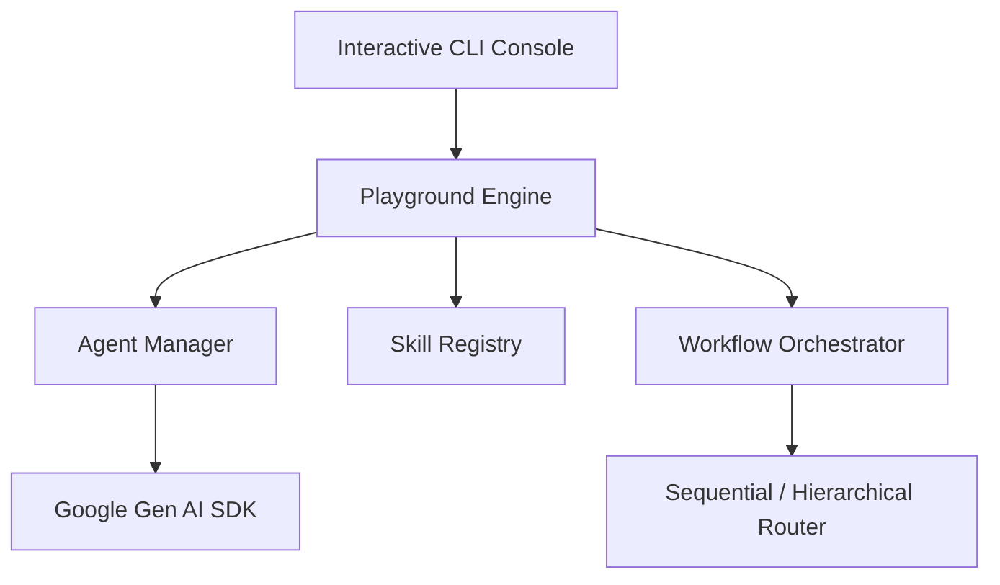

# Option 1: Modular Multi-Agent Workflow Playground

## 🏗️ Architecture Design



## 📂 Proposed Folder Structure

```text
agents-playground/
├── requirements.txt        # google-genai, rich, prompt_toolkit, pydantic
├── playground.py           # Main CLI entry point
├── config.json             # Agent configurations and API setup
├── core/
│   ├── __init__.py
│   ├── agent.py            # BaseAgent class (prompts, history, API call)
│   ├── registry.py         # Skill registry (Dynamic function parsing)
│   └── workflow.py         # Sequential & Supervisor workflows
└── skills/
    ├── __init__.py
    ├── file_ops.py         # Read / write / search files
    └── shell_ops.py        # Safe command execution
```

## ⚙️ Core Technical Implementation Details

### 1. Base Agent Class (`core/agent.py`)
Encapsulates an agent session. Uses the official `google-genai` client:
```python
from google import genai

class BaseAgent:
    def __init__(self, name: str, system_instruction: str, tools: list = None, model: str = "gemini-2.5-flash"):
        self.name = name
        self.system_instruction = system_instruction
        self.tools = tools or []
        self.model = model
        self.history = []

    def reply(self, user_message: str) -> str:
        # Appends message, calls Gemini API with system instruction and tools list, returns text.
        ...
```

### 2. Skill Registry (`core/registry.py`)
A decorator-based registrar that maps custom Python functions to Gemini tools. It automatically parses docstrings and function parameters to generate the required Pydantic schema for tool declaration:
```python
class SkillRegistry:
    def __init__(self):
        self._skills = {}

    def register(self, func):
        self._skills[func.__name__] = func
        return func
```

### 3. Workflow Management (`core/workflow.py`)
Provides runners for orchestration patterns:
- **Sequential Pipeline**: Takes a list of agents and executes them one after another (e.g., input -> `DeveloperAgent` -> code -> `ReviewAgent` -> feedback).
- **Supervisor router**: The user inputs a task. The `SupervisorAgent` reviews the request and invokes helper agents via custom tools, returning the consolidated result.
