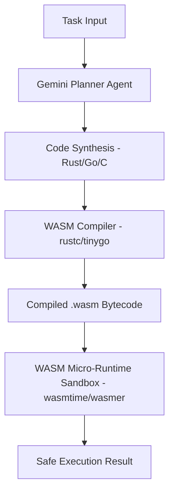

# Option 3: WebAssembly (WASM) Sandboxed Actor Agents

## 🏗️ Architecture Design



## 📂 Proposed Folder Structure

```text
agents-playground/
├── requirements.txt
├── wasm_playground.py       # WASM execution runner
├── core/
│   ├── __init__.py
│   ├── compiler.py          # Automates compiling Rust/Go code to WASM
│   └── wasm_runtime.py      # Executes WASM modules using wasmtime-py
└── library/
    └── wasm_modules/        # Directory containing compiled agent tools (.wasm)
```

## ⚙️ Core Technical Implementation Details

### 1. Multi-Language Code Compilation to WASM
The agent can write tools in Rust, C, or Go. The engine automatically compiles it to a WebAssembly target. For example, if written in Go:
```bash
tinygo build -o library/wasm_modules/my_tool.wasm -target=wasi library/wasm_modules/src/my_tool.go
```

### 2. Micro-Runtime Execution (`core/wasm_runtime.py`)
Using the Python `wasmtime` library, the engine executes the compiled binary in an absolute sandbox with strict resource limits (CPU cycle capping, memory allocation limits, and directory filesystem isolation):
```python
import wasmtime

def execute_wasm(wasm_path: str, args: list) -> str:
    engine = wasmtime.Engine()
    store = wasmtime.Store(engine)
    module = wasmtime.Module.from_file(engine, wasm_path)
    
    # Configure WASI (WebAssembly System Interface) for safe sandboxed I/O
    wasi = wasmtime.WasiConfig()
    wasi.inherit_stdout()
    wasi.inherit_stderr()
    wasi.argv = args
    store.set_wasi(wasi)
    
    linker = wasmtime.Linker(engine)
    linker.define_wasi()
    
    instance = linker.instantiate(store, module)
    exports = instance.exports(store)
    # Run the default start/main function
    ...
```

### Why It's Bleeding Edge
*   **Absolute Sandbox Safety**: Unlike raw Python sub-processes, WASM runs in an isolated virtual machine. An agent cannot make unauthorized syscalls, access arbitrary memory, or modify system files.
*   **Language-Agnostic**: Agents are not restricted to writing Python. They can write performance-critical code in Rust or system tools in Go, compiling everything to the same unified bytecode format.
