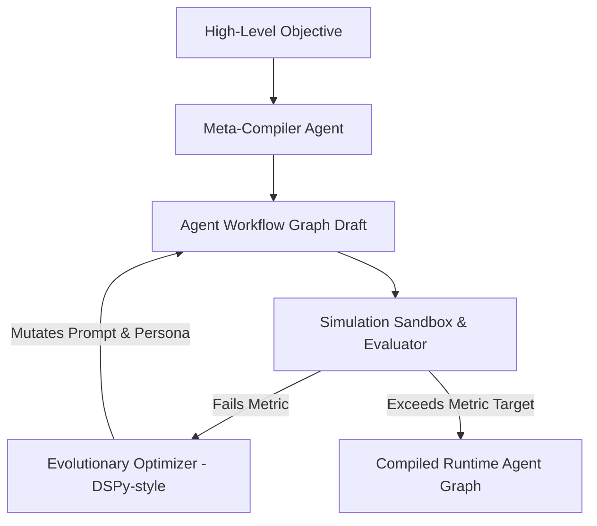

# Option 4: Programmatic Prompt & Weight Evolution (Meta-Agent Compiler)

## 🏗️ Architecture Design



## 📂 Proposed Folder Structure

```text
agents-playground/
├── requirements.txt
├── compile_agent.py          # Meta-Agent Compiler CLI
├── core/
│   ├── __init__.py
│   ├── optimizer.py          # Evolutionary prompt mutations & weight updates
│   ├── evaluator.py          # Evaluates task success using metrics
│   └── graph_runner.py       # Executes stateful agent graphs
└── library/
    └── compiled_agents/      # Directory storing successful prompt/agent configurations
```

## ⚙️ Core Technical Implementation Details

### 1. Programmatic Prompt Optimization
Instead of manually tweaking prompt strings, the system optimizes prompts programmatically (similar to DSPy). The agent writes a prompt template with adjustable parameters (e.g. system guidelines, few-shot examples). The system runs a test suite against a small dataset, measures success, and mutates parameters.

```python
class ProgrammaticAgent:
    def __init__(self, prompt_template: str, few_shot_examples: list):
        self.prompt_template = prompt_template
        self.few_shot_examples = few_shot_examples
        
    def generate_prompt(self) -> str:
        # Interpolates optimized prompt template and selected examples
        ...
```

### 2. Genetic Prompt Mutation Loop
The optimizer runs evolutionary mutations on prompt instructions:
- **Crossover**: Merges instructions from two highly successful agents.
- **Mutation**: Swaps out sub-instructions, adds negative constraints, or refines few-shot examples using a critic agent.

### Why It's Bleeding Edge
*   **No Manual Prompt Engineering**: The developer defines the objective and constraints; the playground writes and tests instructions until they are numerically optimized.
*   **Meta-Agent Compilation**: Generates customized networks of cooperative agents specifically tailored to solve a single, complex task.
