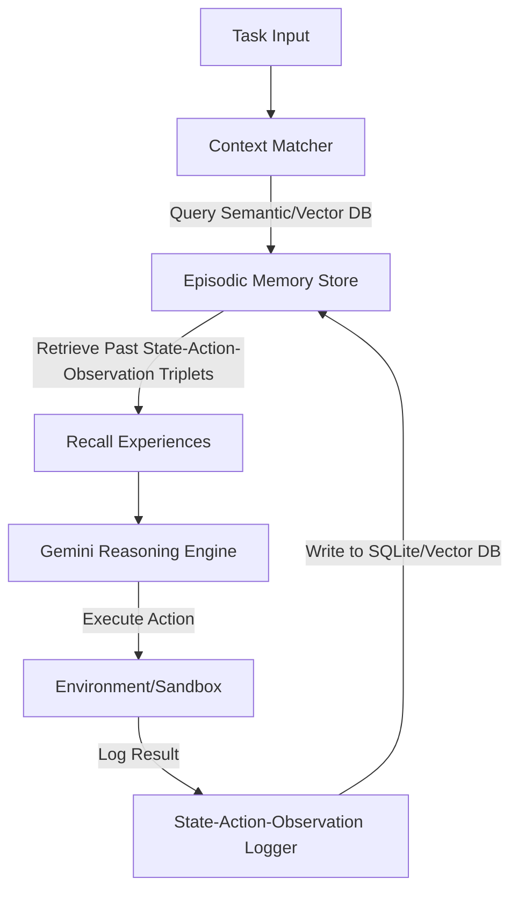

# Option 5: Neuro-Symbolic Episodic Memory (Case-Based Agent Learning)

## 🏗️ Architecture Design



## 📂 Proposed Folder Structure

```text
agents-playground/
├── requirements.txt
├── memory_console.py        # Inspect memory logs and experiences
├── core/
│   ├── __init__.py
│   ├── memory.py            # Episodic memory logger (SQLite + Vector Store)
│   └── agent.py             # Agent equipped with experience recall hooks
└── database/
    └── episodic_memory.db   # Local storage for agent transaction histories
```

## ⚙️ Core Technical Implementation Details

### 1. Episodic State-Action-Observation Logger
The agent saves every step of its execution as a structured record. This database maintains historical transaction logs:
- **State**: The file tree, environment variables, and active prompt.
- **Action**: The specific tool called or code block written by the agent.
- **Observation**: The command output, test result, or sandbox crash stack trace.

```python
import sqlite3
import json

class EpisodicMemory:
    def __init__(self, db_path: str):
        self.conn = sqlite3.connect(db_path)
        self.create_tables()

    def log_episode(self, task_id: str, state: dict, action: str, observation: str, success: bool):
        cursor = self.conn.cursor()
        cursor.execute("""
            INSERT INTO episodes (task_id, state, action, observation, success, timestamp)
            VALUES (?, ?, ?, ?, ?, datetime('now'))
        """, (task_id, json.dumps(state), action, observation, 1 if success else 0))
        self.conn.commit()
```

### 2. Experience Retrieval
Before executing a new task, the agent's prompt generator performs a semantic query on the memory database. It extracts 2-3 most similar past tasks (especially those that failed first but succeeded after mutations) and injects them as few-shot demonstrations:
```python
def get_experience_context(current_task_description: str) -> str:
    # Query vector DB or keyword index for similar past tasks
    # Format and return past successes/corrections
    ...
```

### Why It's Bleeding Edge
*   **True Learning Without Fine-Tuning**: Agents learn from their own mistakes in real-time. If an agent writes a bug, fixes it, and stores the episode, it will never write that exact bug again on future tasks.
*   **Auditability**: Complete log histories of all agent decisions and environmental responses, enabling deterministic rollbacks.
