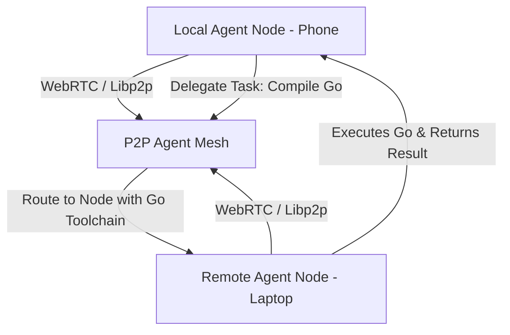

# Option 6: Decentralized P2P Agent Mesh (Swarm Network)

## 🏗️ Architecture Design



## 📂 Proposed Folder Structure

```text
agents-playground/
├── requirements.txt
├── mesh_node.py             # Starts the P2P listener node
├── core/
│   ├── __init__.py
│   ├── network.py           # Handles peer discovery and WebRTC connections
│   └── protocol.py          # Serializes agent task delegation messages
└── config/
    └── peers.json           # Known bootstrap peer addresses
```

## ⚙️ Core Technical Implementation Details

### 1. Peer-to-Peer Protocol
Agents communicate over a peer-to-peer transport layer (e.g. WebRTC or a TCP/IP sockets mesh). Nodes exchange structured task request JSONs:
```json
{
  "request_id": "req-98214",
  "sender_peer_id": "peer-android-termux",
  "task": "Compile this Go script and return the binary",
  "payload": "package main\nimport \"fmt\"\nfunc main() { fmt.Println(\"Hello\") }",
  "required_tools": ["go-compiler"]
}
```

### 2. Capabilities Advertisement
Each node periodically broadcasts its capabilities (installed software, available CPU/GPU power, active compiled WASM tools). When an agent needs a skill it or its local system doesn't have, it routes the task to a capable peer:
```python
class MeshNode:
    def __init__(self, bootstrap_peers):
        self.peer_id = generate_peer_id()
        self.connected_peers = {}
        self.capabilities = ["python-runner", "git-ops"]

    def delegate_task(self, target_capability: str, task_data: dict):
        peer = self.find_peer_with_capability(target_capability)
        if peer:
            self.send_message(peer, "task_request", task_data)
```

### Why It's Bleeding Edge
*   **Decentralized Collaboration**: Build an ecosystem where multiple devices (phone, desktop, home server) act as a single cooperative brain.
*   **Horizontal Resource Sharing**: A resource-constrained Termux session on an Android phone can seamlessly outsource heavy compilation or testing tasks to a high-powered desktop node in the same mesh network.
